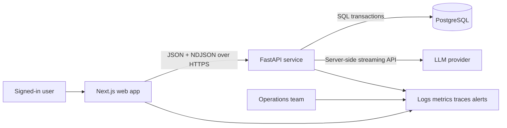
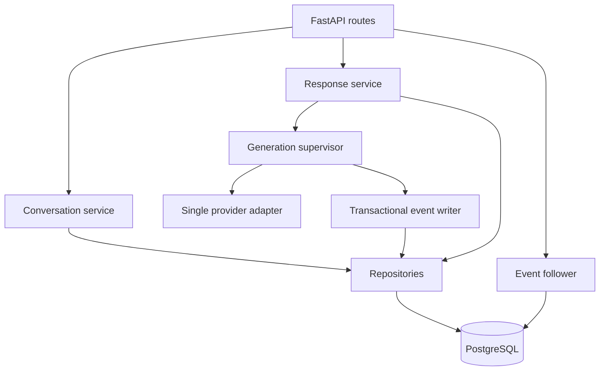
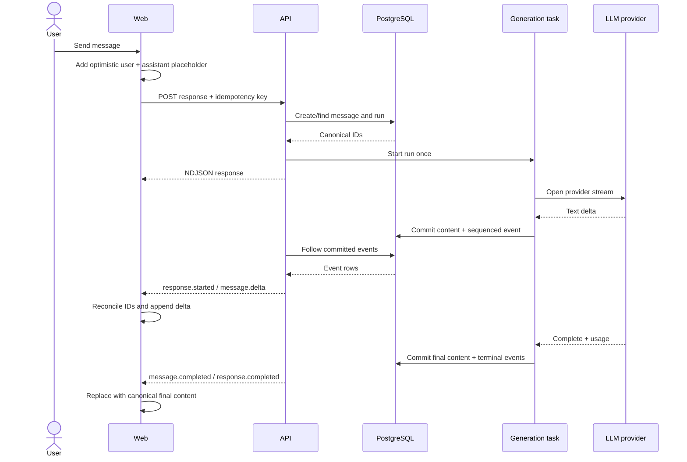
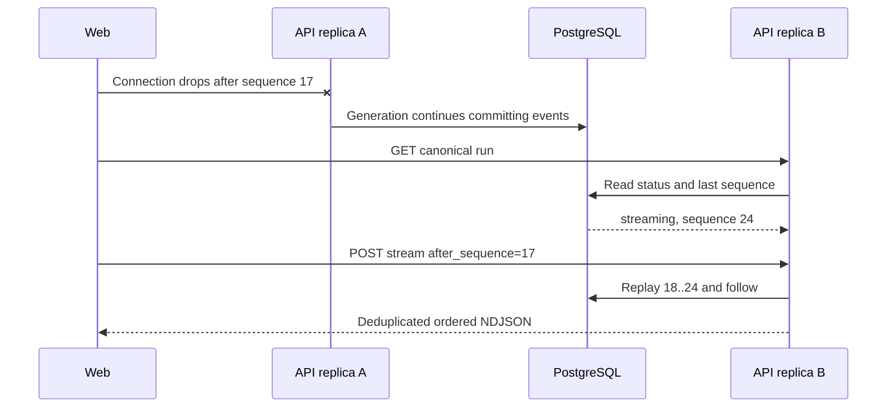
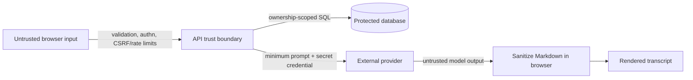

# Architecture Diagrams

## System context



## Backend containers



## Send and stream sequence



## Disconnect and replay



## Cancel race

```mermaid
sequenceDiagram
    actor User
    participant Web
    participant API
    participant DB
    participant Gen

    User->>Web: Stop
    Web->>Web: Abort local reader; show stopping
    Web->>API: POST cancel
    API->>DB: Set cancel_requested_at
    API-->>Web: Current run snapshot
    Gen->>DB: Observe cancel at next boundary
    Gen->>Gen: Close provider stream
    Gen->>DB: Commit partial + response.cancelled
    Web->>API: Reconcile/follow
    API-->>Web: Canonical cancelled state
```

## Trust boundaries


