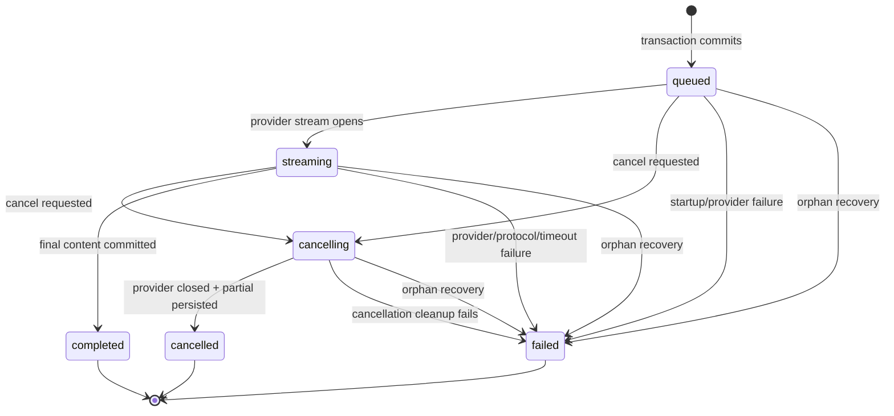
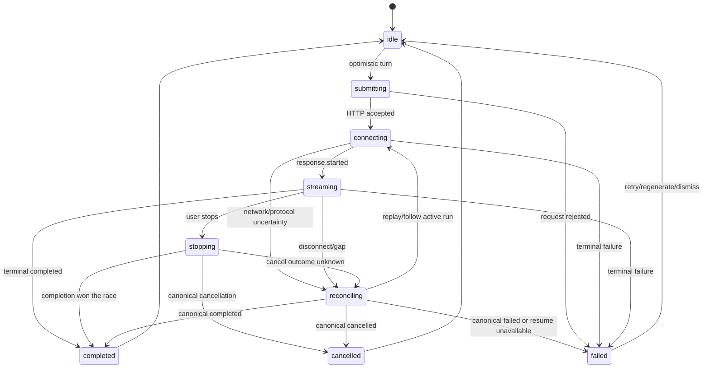

# State Machines

## 1. Response run state

Allowed states are `queued`, `streaming`, `cancelling`, `completed`, `cancelled`, and `failed`. Terminal states never transition. Retry and regenerate create a new run; they do not reopen an old run.

## 2. Client stream state

The reducer stores state per run, not in one global loading boolean. Navigation to another conversation does not cancel a run unless the user explicitly stops it.

## 3. Message state

User messages move `optimistic → persisted` or `optimistic → rejected`. Assistant messages move `placeholder → partial → complete|cancelled|failed`. Server history can replace any non-canonical client state during reconciliation.

## 4. Transition invariants

- Apply an event only when its run ID matches and its sequence is newer.
- `response.started` must precede deltas in a fresh stream; replay may begin with `response.snapshot`.
- Only `message.delta` appends content.
- `message.completed` replaces content.
- A terminal response freezes controls except retry/regenerate.
- Cancellation shown as final only after canonical confirmation; local abort alone means “stopping” or “reconciling.”
- A sequence gap never guesses missing text; it triggers replay.
